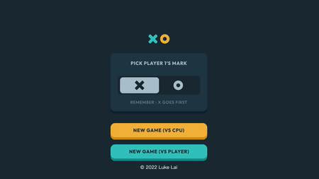

This Tic-Tac-Toe game built with the React framework .

## Table of contents

- [Overview](#overview)
  - [Screenshot](#screenshot)
  - [Links](#links)
- [My process](#my-process)
  - [Built with](#built-with)
- [Author](#author)

## Overview

Users should be able to:

- This is a tic-Tac-Toe game built with the React framework . 
- Player can play Tic-Tac-Toe with the computer. 
- Start a new game with the reset button.

### Screenshot

### Links

- Live Site: [Click here](https://steady-kelpie-2829ee.netlify.app/)

### Built with

- React JS
- Semantic HTML5 markup
- CSS custom properties
- Flexbox
- CSS Grid
- Sass/Scss

### Scripts

In the project directory, you can run:

#### `npm install`
#### `npm start`

Runs the app in the development mode.\
Open [http://localhost:3000](http://localhost:3000) to view it in your browser.

## Author

- Website - [Luke Lai](https://lukelai.tech/)
- LinkedIn - [Luke Lai](https://www.linkedin.com/in/luke-lai-309a3522b/)
- Twitter - [@LukeLaiDev](https://www.twitter.com/LukeLaiDev)

